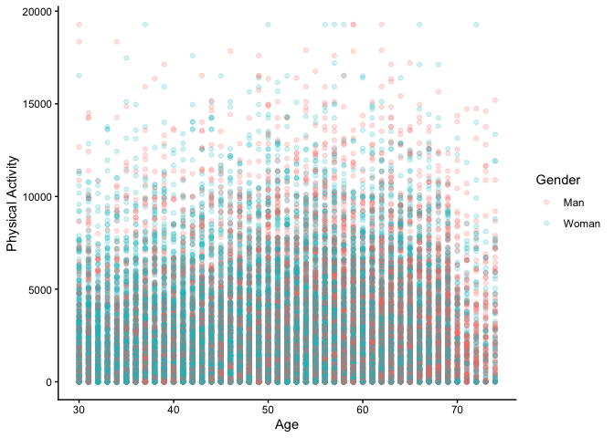

``` r
library(rstatix)
```

```
## 
## Attaching package: 'rstatix'
```

```
## The following object is masked from 'package:stats':
## 
##     filter
```

``` r
library(tidyverse)
```

```
## ── Attaching core tidyverse packages ──────────────────────── tidyverse 2.0.0 ──
## ✔ dplyr     1.1.4     ✔ readr     2.1.5
## ✔ forcats   1.0.0     ✔ stringr   1.5.2
## ✔ ggplot2   4.0.0     ✔ tibble    3.3.0
## ✔ lubridate 1.9.4     ✔ tidyr     1.3.1
## ✔ purrr     1.1.0
```

```
## ── Conflicts ────────────────────────────────────────── tidyverse_conflicts() ──
## ✖ dplyr::filter() masks rstatix::filter(), stats::filter()
## ✖ dplyr::lag()    masks stats::lag()
## ℹ Use the conflicted package (<http://conflicted.r-lib.org/>) to force all conflicts to become errors
```

``` r
library(pastecs)
```

```
## 
## Attaching package: 'pastecs'
## 
## The following objects are masked from 'package:dplyr':
## 
##     first, last
## 
## The following object is masked from 'package:tidyr':
## 
##     extract
```

``` r
library(knitr)
library(epitools)
library(Epi)

options(scipen=999) 
```


``` r
data <- read_csv("can_path_data.csv")
```

```
## Warning: One or more parsing issues, call `problems()` on your data frame for details,
## e.g.:
##   dat <- vroom(...)
##   problems(dat)
```

```
## Rows: 41187 Columns: 440
## ── Column specification ────────────────────────────────────────────────────────
## Delimiter: ","
## chr   (5): ID, MSD11_PR, MSD11_REG, MSD11_ZONE, MSD11_CMA
## dbl (425): ADM_STUDY_ID, SDC_GENDER, SDC_AGE_CALC, SDC_MARITAL_STATUS, SDC_E...
## lgl  (10): DIS_MH_BIPOLAR_EVER, DIS_GEN_DS_EVER, DIS_GEN_SCA_EVER, DIS_GEN_T...
## 
## ℹ Use `spec()` to retrieve the full column specification for this data.
## ℹ Specify the column types or set `show_col_types = FALSE` to quiet this message.
```

## General instructions

### 1. Identify the variable types for each variable in the dataset


``` r
glimpse(data)
```

All of the variables here currently coded as _dbl_ except `ID` which is _chr_. That's incorrect and we are going to need to fix that when we recode.


``` r
### Select specific columns
cols <- c("SDC_EDU_LEVEL", "HS_GEN_HEALTH", "HS_ROUTINE_VISIT_EVER", "HS_ROUTINE_VISIT_LAST", "HS_DENTAL_VISIT_EVER", "HS_DENTAL_VISIT_LAST")
data <- data %>% mutate_at(cols, factor)
```


``` r
glimpse(data)
```


``` r
### Select by column number
data <- data %>% mutate_at(10:15, factor)
```


``` r
glimpse(data)
```

### 3. Recode and label categorical variables as necessary


``` r
data <- data %>%
	mutate(gender_recode = case_when(
		SDC_GENDER == 1 ~ "Male",
    SDC_GENDER == 2 ~ "Female"
	))

data$gender_recode <- as.factor(data$gender_recode) 

### Checking our code to make sure our recode is correct
table(data$SDC_GENDER, data$gender_recode)
```

```
##    
##     Female  Male
##   1      0 15200
##   2  25987     0
```

### Add the `NUT_VEG_QTY` and the `NUT_FRUITS_QTY` to create one variable
    * Create a categorical variable that represents the recommended fruit and vegetable consumption per day


``` r
summary(data$NUT_VEG_QTY)
```

```
##    Min. 1st Qu.  Median    Mean 3rd Qu.    Max.    NA's 
##   0.000   2.000   2.000   2.672   3.000  35.000    2549
```

``` r
summary(data$NUT_FRUITS_QTY)
```

```
##    Min. 1st Qu.  Median    Mean 3rd Qu.    Max.    NA's 
##   0.000   1.000   2.000   2.132   3.000  25.000    2426
```

``` r
### No missing data the no weird codings for the numbers. Great! 

data <- data %>%
	mutate(fruit_veg_tot = NUT_VEG_QTY + NUT_FRUITS_QTY)

summary(data$fruit_veg_tot)
```

```
##    Min. 1st Qu.  Median    Mean 3rd Qu.    Max.    NA's 
##   0.000   3.000   4.000   4.816   6.000  55.000    2908
```

``` r
data <- data %>%
	mutate(fruit_veg_cat = case_when(
		fruit_veg_tot <= 7  ~ "Not Meeting Guidelines",
    fruit_veg_tot > 7 ~ "Meeting Guidelines"
	))

table(data$fruit_veg_cat)
```

```
## 
##     Meeting Guidelines Not Meeting Guidelines 
##                   5237                  33042
```

``` r
data <- data %>%
	mutate(fruit_veg_dic = case_when(
		fruit_veg_tot <= 7 ~ 0,
    fruit_veg_tot > 7 ~ 1
	))

table(data$fruit_veg_tot, data$fruit_veg_cat)
```

```
##     
##      Meeting Guidelines Not Meeting Guidelines
##   0                   0                    404
##   1                   0                   1561
##   2                   0                   5015
##   3                   0                   5807
##   4                   0                   6720
##   5                   0                   5525
##   6                   0                   4955
##   7                   0                   3055
##   8                2200                      0
##   9                1213                      0
##   10                816                      0
##   11                433                      0
##   12                226                      0
##   13                125                      0
##   14                 87                      0
##   15                 29                      0
##   16                 45                      0
##   17                 13                      0
##   18                 12                      0
##   19                  4                      0
##   20                  7                      0
##   21                  1                      0
##   22                  2                      0
##   24                  1                      0
##   25                  1                      0
##   26                  1                      0
##   27                  2                      0
##   28                  4                      0
##   30                  2                      0
##   31                  1                      0
##   32                  3                      0
##   34                  1                      0
##   35                  1                      0
##   44                  1                      0
##   45                  1                      0
##   49                  2                      0
##   50                  1                      0
##   51                  1                      0
##   55                  1                      0
```

### Create a categorical variable for the `PA_TOTAL_SHORT` variable the defines low, moderate, and high activity per week
    * Low - < 600 MET minutes per week
    * Moderate - >=600 to <3000 MET minutes per week
    * High - >=3000 MET minutes per week

### Calculate the mean and standard deviation
    * For the variables were it is appropriate
    * Including the new variables you have created
    

``` r
summary(data$PA_TOTAL_SHORT)
```

```
##    Min. 1st Qu.  Median    Mean 3rd Qu.    Max.    NA's 
##       0     600    1782    2574    3732   19278    6763
```

``` r
data <- data %>%
	mutate(pa_cat = case_when(
		PA_TOTAL_SHORT < 600  ~ "Low Activity",
		PA_TOTAL_SHORT >= 3000 ~ "High Activity",
		PA_TOTAL_SHORT >= 600 ~ "Moderate Activity"
	))

### Flag we need to put the low and how activity first otherwise we don't get the right answer
```

### Calculate the percents and frequencies 
    * For the variables were it is appropriate to do so

There are __MANY__ different ways to do this in R. There is no one best way. 


``` r
## First we need to make sure we get the variables recoded and organized

### Example with gender where we already recoded
gender_table <- bind_rows(table(data$gender_recode), prop.table(table(data$gender_recode)))

### Example with fruit_veg_cat where we already recoded
fruit_veg_table <- bind_rows(table(data$fruit_veg_cat), prop.table(table(data$fruit_veg_cat)))
```

### Are there missing data?


``` r
summary(data$fruit_veg_tot)
```

```
##    Min. 1st Qu.  Median    Mean 3rd Qu.    Max.    NA's 
##   0.000   3.000   4.000   4.816   6.000  55.000    2908
```

### Create a 2*2 table for fruit and vegetable consumption by gender
    * Interpret the 2*2 table result


``` r
gender_fv_table <- table(data$gender_recode, data$fruit_veg_cat)
gender_fv_table
```

```
##         
##          Meeting Guidelines Not Meeting Guidelines
##   Female               4004                  20213
##   Male                 1233                  12829
```

## Joining datasets

### Stacking 2 datasets on top of each other

If we want to stack two datasets we need to use the `bind` set of functions. We can either use `bind_rows` or `bind_cols` from the `tidyverse` set of packages to do this. Let's say we have two datasets with the same information but different participants. We want to stack them so we can do some bigger analysis. 


``` r
data1 <- read_csv("data_1.csv")
```

```
## Rows: 200 Columns: 11
## ── Column specification ────────────────────────────────────────────────────────
## Delimiter: ","
## dbl (11): id, sex, ethgrp, weight, age, cvd, stroke, smoking, Cancer, ldl1, ...
## 
## ℹ Use `spec()` to retrieve the full column specification for this data.
## ℹ Specify the column types or set `show_col_types = FALSE` to quiet this message.
```

``` r
data2 <- read_csv("data_2.csv")
```

```
## Rows: 200 Columns: 11
## ── Column specification ────────────────────────────────────────────────────────
## Delimiter: ","
## dbl (11): id, sex, ethgrp, weight, age, cvd, stroke, smoking, Cancer, ldl1, ...
## 
## ℹ Use `spec()` to retrieve the full column specification for this data.
## ℹ Specify the column types or set `show_col_types = FALSE` to quiet this message.
```

Data1 and Data2 have the some number and information in the columns but they are not together. We can join them using `bind_rows`. 


``` r
data_1_2 <- bind_rows(data1, data2)
```

2. Join by ID

If you have 2 datasets with different data that you want to join you can use different join methods. These terms are from computer science. `full_join`, `left_join`, `right_join`, etc. 


``` r
names_data <- read_csv("names.csv")
```

```
## Rows: 800 Columns: 2
## ── Column specification ────────────────────────────────────────────────────────
## Delimiter: ","
## chr (1): parent
## dbl (1): id
## 
## ℹ Use `spec()` to retrieve the full column specification for this data.
## ℹ Specify the column types or set `show_col_types = FALSE` to quiet this message.
```

``` r
glimpse(names_data)
```

```
## Rows: 800
## Columns: 2
## $ id     <dbl> 1, 2, 3, 4, 5, 6, 7, 8, 9, 10, 11, 12, 13, 14, 15, 16, 17, 18, …
## $ parent <chr> "Cesar", "Brandon", "Molly", "Mathew", "Gabrielle", "Chloe", "H…
```

``` r
data_all <- left_join(data_1_2, names_data, by = join_by(id))
table(data_all$parent)
```

```
## 
##        Aasim Abdul Baasid        Adjoa       Adrena       Afraah       Alanna 
##            1            1            1            1            2            1 
##      Alberto         Alec    Alexander    Alexandra   Alexandria       Alexis 
##            1            1            1            1            1            2 
##      Alfonso      Aliceia       Alisha       Almira       Alyssa        Amaya 
##            1            1            2            1            1            1 
##        Amber       Ammaar          Ana     Anamaria       Andrew        Angel 
##            1            1            2            1            1            1 
##     Angelica     Angelina         Anna        Anwar       Arissa      Asashia 
##            3            2            1            1            1            1 
##     Ashleigh       Ashley        Asmaa       Audrey       Austin       Baaqir 
##            1            2            1            1            1            1 
##        Badri   Badruddeen       Baheej       Baosan      Bethany       Bobbie 
##            1            1            1            1            1            1 
##       Brandi      Brandon      Braxton       Breana      Britney     Brittany 
##            1            5            1            1            1            4 
##       Brooks        Bryce       Caigen       Cannon       Carlos      Carmela 
##            1            1            1            1            1            1 
##       Carson     Casandra    Catherine    Celistina        Cesar      Chaerin 
##            1            1            1            1            2            1 
##       Chance     Charlene      Charles    Charlotte        Chase     Cheyenne 
##            1            1            2            1            1            1 
##        Chloe    Christian  Christopher       Colton       Crysta      Cynthia 
##            1            1            1            1            1            1 
##       Dakota       Damian       Damien        Damon       Daniel     Danielle 
##            1            2            1            1            2            1 
##        David   Dayveontay       Deanna    Demetrius        Devin     Doan Anh 
##            2            1            1            1            1            1 
##      Dominic    Dominique       Dontae        Edgar       Edrick       Elijah 
##            1            1            1            1            1            1 
##    Elizabeth       Emilio        Emily         Emma         Eric    Estefania 
##            1            1            1            1            1            1 
##       Estela       Eun-Ji         Evan      Faarooq       Faatin        Fawzi 
##            1            1            1            1            1            1 
##       Faydra   Fransiscus    Frederick    Friedrich    Gabriella    Gabrielle 
##            1            1            1            1            1            1 
##       Garett      Gavriel    Genevieve     Gilberto       Gracie        Grant 
##            1            1            1            1            1            1 
##    Guadalupe    Guillermo       Hailey        Haley        Hamdi       Hannah 
##            2            1            1            1            1            2 
##      Harmony       Harold        Hasan         Hawe       Haylie      Heather 
##            1            1            1            1            1            1 
##       Heddie         Hope       Hunter     Ignatius        Ihaab       Ilhaam 
##            1            1            1            1            1            1 
##        Imani        Isaac       Iyonna        Izzat         Jack      Jackson 
##            1            1            1            1            1            2 
##        Jacob         Jade      Jaelynn        Jaime        Jalen        Jamal 
##            2            1            1            1            1            1 
##        James        Janae      Janelle       Jaquay        Jared        Jenny 
##            1            1            1            1            1            1 
##       Jeremy      Jessica         John       Jordan       Joshua     Jourdayn 
##            1            2            2            4            3            1 
##      Juanita        Julia     Julianna       Junior       Justen      Justice 
##            1            1            2            1            1            1 
##        Kacey      Kaitlyn       Kamrin        Karen         Kari        Karin 
##            1            1            1            2            1            1 
##    Kassandra       Kateri    Katherine      Kathryn      Katrina      Kayanna 
##            1            1            1            1            1            1 
##        Kayla        Kelly Kelton David          Ken      Kennedy        Kenny 
##            1            2            1            1            1            1 
##        Kevin         Khoa       Kiante        Kiara      Kirsten   Kristopher 
##            1            1            1            1            1            1 
##         Kyle         Kyra        Ladan        Lance       Lauren         Leon 
##            2            1            1            1            1            1 
##       Leslie          Lia      Lindsey        Logan         Lois        Lucas 
##            1            1            1            2            1            1 
##        Lucky        Lukas     Lutfiyya    Mackenzie      Madalyn      Madison 
##            1            1            2            1            1            1 
##      Mahalia         Maia       Manaal        Maria       Mariah       Marina 
##            1            1            1            2            1            1 
##       Marisa       Martin      Marwaan        Mason      Mastoor       Mathew 
##            1            1            1            1            1            1 
##      Matthew      Maurice         Maya     Mckenzie      Mechale     Michelle 
##            3            1            4            1            1            1 
##       Miguel      Mikayla       Milton       Minnah      Mohamed        Molly 
##            1            1            1            1            1            1 
##      Monique       Morgan       Muslim      Mustaba       Mystic      Na'Inoa 
##            1            2            1            1            1            1 
##      Nafeesa      Najiyya       Nariah     Nashelle       Nathan       Nawaar 
##            1            1            1            1            1            1 
##     Nawwaara        Nbyee     Nicholas        Niomi         Omar      Paisley 
##            1            1            2            1            1            1 
##       Pamela        Pearl      Raabiya         Rabi       Rachel     Rachelee 
##            1            1            1            1            1            1 
##      Raihaan       Ramesh     Randilyn       Rashad      Rashele         Raul 
##            1            1            1            1            1            1 
##       Razeen      Rebecca       Reilly      Ricardo      Richard       Rickia 
##            1            1            1            1            1            1 
##       Robert      Roselyn       Roshae       Rushdi      Rutaiba         Ryan 
##            1            1            1            1            1            1 
##      Saabira      Saarang        Saeed         Saje     Samantha      Sameeha 
##            1            1            1            1            1            1 
##       Samuel       Sandra         Sara        Sarah     Savannah       Shaafi 
##            1            2            2            3            1            1 
##     Shakeela        Shane      Shannon       Shayla       Shelby     Shontice 
##            1            1            1            1            1            1 
##      Shuraih      Si Hien       Sierra       Smokey       Stacie     Stefanie 
##            1            1            1            1            1            1 
##      Stephon     Stephvon       Steven       Stevie       Sultan      Sumayya 
##            1            1            1            1            1            1 
##       Sydney        Tahma      Tamanna     Tausolia      Tawfeeq       Taylor 
##            2            1            1            1            1            3 
##       Tayyib     Terrance     Theodore       Tiesha      Timothy        Torey 
##            1            1            1            1            1            1 
##         Trae          Tre         Trey         Tuan        Turfa           Ty 
##            1            1            1            1            1            1 
##       Tyesha        Tyler        Tyrel        Tyrin       Ubaida      Ulysses 
##            1            4            1            1            1            1 
##       Usaama       Vanesa      Vanessa     Victoria        Vilok      Vincent 
##            1            1            3            1            1            1 
##       Waatiq      Waheeda        Wendy       Wesley         Will       Xavier 
##            1            1            1            1            1            1 
##       Yadira      Zachary      Zakkary      Zayyaan          Zoe 
##            2            1            1            2            1
```


## Data Viz

### 1. ggplot2 General

ggplot2 is an open-source data visualization package for the statistical programming language R. Created by Hadley Wickham in 2005, ggplot2 is an implementation of Leland Wilkinson's Grammar of Graphics—a general scheme for data visualization which breaks up graphs into semantic components such as scales and layers.[Wikipedia](https://en.wikipedia.org/wiki/Ggplot2) The basic idea is to build plots layer by layer. With ggplot2 you can control absolutely everything about a plot. 

Data viz is a big place where R and Stata diverge a lot. With R giving much more flexibility (and sometimes annoyance) in terms of visualizing data. We are going to cover basics but recommend the BBC Code Book [https://bbc.github.io/rcookbook/](https://bbc.github.io/rcookbook/) and Keiran Healey's book _Data Visualization_ [https://kieranhealy.org/publications/dataviz/](https://kieranhealy.org/publications/dataviz/) which is part of the the `socviz` package [https://kjhealy.github.io/socviz/](https://kjhealy.github.io/socviz/. )

### 2. Histograms and single variable box plots

ggplot2 is built on things called *geoms* which represent different types of plots. There are *geoms* for histograms, scatterplots, beeswarm, and many other plots. Here we are focusing two basic plots and the defaults of everything else. 

#### Histograms


``` r
pa_histo <- ggplot(data, aes(PA_TOTAL_SHORT)) + 
              geom_histogram()
plot(pa_histo)
```

```
## `stat_bin()` using `bins = 30`. Pick better value `binwidth`.
```

```
## Warning: Removed 6763 rows containing non-finite outside the scale range
## (`stat_bin()`).
```

<!-- -->

Here *ggplot2* is gives us a warning because the binwidth might not be appropriate. We can pick another binwidth. 


``` r
pa_histo_bin_100 <- ggplot(data, aes(PA_TOTAL_SHORT)) + 
              geom_histogram(binwidth = 100)
plot(pa_histo_bin_100)
```

```
## Warning: Removed 6763 rows containing non-finite outside the scale range
## (`stat_bin()`).
```

<!-- -->

#### Single bar graphs

People get stuck in R making bar graphs because they are used to Excel and only have the mean value of a given column then making the bar graph from that mean column. It's always questionnable whether you should be making a bar graph, but if you really need to here is how you can do it in R. 


``` r
# Recoding income here so we can see the levels more easily

data <- data %>%
	mutate(income_recode = case_when(
		SDC_INCOME == 1 ~ "1_Less than 10 000 $",
    SDC_INCOME == 2 ~ "2_10 000 $ - 24 999 $",
		SDC_INCOME == 3 ~ "3_25 000 $ - 49 999 $",
		SDC_INCOME == 4 ~ "4_50 000 $ - 74 999 $",
    SDC_INCOME == 5 ~ "5_75 000 $ - 99 999 $",
		SDC_INCOME == 6 ~ "6_100 000 $ - 149 999 $",
    SDC_INCOME == 7 ~ "7_150 000 $ - 199 999 $",
    SDC_INCOME == 8 ~	"8_200 000 $ or more"
	))

table(data$SDC_INCOME, data$income_recode)
```

```
##    
##     1_Less than 10 000 $ 2_10 000 $ - 24 999 $ 3_25 000 $ - 49 999 $
##   1                  472                     0                     0
##   2                    0                  1985                     0
##   3                    0                     0                  5745
##   4                    0                     0                     0
##   5                    0                     0                     0
##   6                    0                     0                     0
##   7                    0                     0                     0
##   8                    0                     0                     0
##    
##     4_50 000 $ - 74 999 $ 5_75 000 $ - 99 999 $ 6_100 000 $ - 149 999 $
##   1                     0                     0                       0
##   2                     0                     0                       0
##   3                     0                     0                       0
##   4                  6831                     0                       0
##   5                     0                  6602                       0
##   6                     0                     0                    7600
##   7                     0                     0                       0
##   8                     0                     0                       0
##    
##     7_150 000 $ - 199 999 $ 8_200 000 $ or more
##   1                       0                   0
##   2                       0                   0
##   3                       0                   0
##   4                       0                   0
##   5                       0                   0
##   6                       0                   0
##   7                    3463                   0
##   8                       0                2555
```


``` r
bar_income <- ggplot(data, aes(income_recode)) + 
                geom_bar() + 
                labs(x = "Income Categories") + 
                theme(axis.text.x = element_text(angle = 90))       
plot(bar_income)
```

<!-- -->

#### Single variable boxplots


``` r
boxplot <- ggplot(data, aes(PA_TOTAL_SHORT)) + 
              geom_boxplot() + 
              coord_flip()  # Here we add coord_flip function to make the boxplot more as we would expect
plot(boxplot)
```

```
## Warning: Removed 6763 rows containing non-finite outside the scale range
## (`stat_boxplot()`).
```

<!-- -->

### 3. Scatter plots

Scatterplots plot the relationship between two variables. There are lots of things we can do and we will build a plot sequentially. We are going to plot the relationship between age and physical activity (two continuous variables). 


``` r
scatter_plot <- ggplot(data, aes(x = SDC_AGE_CALC, y = PA_TOTAL_SHORT)) + 
                  geom_point()
plot(scatter_plot)
```

```
## Warning: Removed 6763 rows containing missing values or values outside the scale range
## (`geom_point()`).
```

<!-- -->

Common things you will see with a scatter plot including the following

#### Adding a regression line

Here we add another *geom* on top of the *geom_point* to start building our plot. We will use *geom_smooth* to add a line. The default in R is a lowess smoother. You can also add a linear regression line. I'm also changing the colour so we can see the difference between the two lines. It's best to use hexcodes for colours but we can also just use words. 


``` r
scatter_plot_line <- ggplot(data, aes(x = SDC_AGE_CALC, y = PA_TOTAL_SHORT)) + 
                  geom_point() + 
                  geom_smooth(colour = "red") + 
                  geom_smooth(method = "lm", colour = "#088da5")
plot(scatter_plot_line)
```

```
## `geom_smooth()` using method = 'gam' and formula = 'y ~ s(x, bs = "cs")'
```

```
## Warning: Removed 6763 rows containing non-finite outside the scale range
## (`stat_smooth()`).
```

```
## `geom_smooth()` using formula = 'y ~ x'
```

```
## Warning: Removed 6763 rows containing non-finite outside the scale range
## (`stat_smooth()`).
```

```
## Warning: Removed 6763 rows containing missing values or values outside the scale range
## (`geom_point()`).
```

<!-- -->

#### Changing the variable names


``` r
scatter_plot_variables <- ggplot(data, aes(x = SDC_AGE_CALC, y = PA_TOTAL_SHORT)) + 
                  geom_point() + 
                  geom_smooth(colour = "red") + 
                  geom_smooth(method = "lm", colour = "#088da5") +
                  labs(x = "Age", y = "Physical Activity")
plot(scatter_plot_variables)
```

```
## `geom_smooth()` using method = 'gam' and formula = 'y ~ s(x, bs = "cs")'
```

```
## Warning: Removed 6763 rows containing non-finite outside the scale range
## (`stat_smooth()`).
```

```
## `geom_smooth()` using formula = 'y ~ x'
```

```
## Warning: Removed 6763 rows containing non-finite outside the scale range
## (`stat_smooth()`).
```

```
## Warning: Removed 6763 rows containing missing values or values outside the scale range
## (`geom_point()`).
```

<!-- -->

#### Changing the shading of the points

We can use *alpha* to change the shading of the points. This lets use quickly avoid overplotting with lots of overlapping points. We need to play with this a bit. A good place to start is 0.5 and go from there. I ended up at 0.2 which I think shows the mass of data points and avoids too much emphasis on the outlier points. 


``` r
scatter_plot_alpha <- ggplot(data, aes(x = SDC_AGE_CALC, y = PA_TOTAL_SHORT)) + 
                  geom_point(alpha = 0.2) + 
                  geom_smooth(colour = "red") + 
                  geom_smooth(method = "lm", colour = "#088da5") +
                  labs(x = "Age", y = "Physical Activity")
plot(scatter_plot_alpha)
```

```
## `geom_smooth()` using method = 'gam' and formula = 'y ~ s(x, bs = "cs")'
```

```
## Warning: Removed 6763 rows containing non-finite outside the scale range
## (`stat_smooth()`).
```

```
## `geom_smooth()` using formula = 'y ~ x'
```

```
## Warning: Removed 6763 rows containing non-finite outside the scale range
## (`stat_smooth()`).
```

```
## Warning: Removed 6763 rows containing missing values or values outside the scale range
## (`geom_point()`).
```

<!-- -->

### 4. Grouping with ggplot2

One of the best things about ggplot2 is the ability to easily *group_by* like we would do with data wrangling. We do this by adding groupings (colouring by a variable) or facets (creating separate plots). Here we want to group by gender to see if there are visual differences between genders in the age-PA association. 


``` r
# Recoding gender here so we can see the man/women in the plot instead of 1 and 2

data <- data %>%
	mutate(gender_recode = case_when(
		SDC_GENDER == 1 ~ "Man",
    SDC_GENDER == 2 ~ "Woman"
	))
```

Colouring by gender

``` r
scatter_plot_gender <- ggplot(data, aes(x = SDC_AGE_CALC, y = PA_TOTAL_SHORT, colour = gender_recode)) + 
                  geom_point(alpha = 0.2) + 
                  labs(x = "Age", y = "Physical Activity", fill = "Gender") 
plot(scatter_plot_gender)
```

```
## Ignoring unknown labels:
## • fill : "Gender"
```

```
## Warning: Removed 6763 rows containing missing values or values outside the scale range
## (`geom_point()`).
```

<!-- -->

Faceting by gender

``` r
scatter_plot_gender <- ggplot(data, aes(x = SDC_AGE_CALC, y = PA_TOTAL_SHORT)) + 
                  geom_point(alpha = 0.2) + 
                  labs(x = "Age", y = "Physical Activity") +
                  facet_wrap(~ gender_recode)
plot(scatter_plot_gender)
```

```
## Warning: Removed 6763 rows containing missing values or values outside the scale range
## (`geom_point()`).
```

<!-- -->


### 5. Colours and themes

Finally, there are many default colours and themes we can use to make the plots look good very quickly. A few things I use regularly. 

#### Themes

There are two themes I use regularly; *classic* and *bw*. Classic provides a clean looking plot with no/limited background. *bw* provides a black and white figure, which is great for publications that need no colour. 

**Black and White Theme**


``` r
scatter_plot_bw <- ggplot(data, aes(x = SDC_AGE_CALC, y = PA_TOTAL_SHORT, colour = gender_recode)) + 
                  geom_point(alpha = 0.2) + 
                  labs(x = "Age", y = "Physical Activity", colour = "Gender") +
                  theme_bw()
plot(scatter_plot_bw)
```

```
## Warning: Removed 6763 rows containing missing values or values outside the scale range
## (`geom_point()`).
```

<!-- -->

**Classic Theme**


``` r
scatter_plot_classic <- ggplot(data, aes(x = SDC_AGE_CALC, y = PA_TOTAL_SHORT, colour = gender_recode)) + 
                  geom_point(alpha = 0.2) + 
                  labs(x = "Age", y = "Physical Activity", colour = "Gender") +
                  theme_classic()
plot(scatter_plot_classic)
```

```
## Warning: Removed 6763 rows containing missing values or values outside the scale range
## (`geom_point()`).
```

<!-- -->

#### Colours

There are lots of default colours in R. The basic functions are *scale_colour* and *scale_fill*. We didn't talk about this much but colour and fill are different based what you are filling. If we go back to the gender colouring we can use different functions to change the colours. The colour brewer colours [https://colorbrewer2.org/](https://colorbrewer2.org/) using *scale_colour_brewer* or *scale_fill_brewer* for sensible default colours. 


``` r
scatter_plot_gender_brewer <- ggplot(data, aes(x = SDC_AGE_CALC, y = PA_TOTAL_SHORT, colour = gender_recode)) + 
                  geom_point(alpha = 0.2) + 
                  scale_colour_manual(values = c("#E69F00", "#56B4E9")) +
                  labs(x = "Age", y = "Physical Activity", colour = "Gender") 
plot(scatter_plot_gender_brewer)
```

```
## Warning: Removed 6763 rows containing missing values or values outside the scale range
## (`geom_point()`).
```

<!-- -->

## geom_*

There are lots of different geoms available with the standard `ggplot2` package [https://ggplot2.tidyverse.org/reference/](https://ggplot2.tidyverse.org/reference/), but there are also lots of other ones developed by the community in specific packages. For example, if we wanted to make a [joy plot](https://katherinemwood.github.io/post/joy/) we could use the `ggridges` package. Let's try. First, find a tutorial online and see if you can apply it to your data. I used [this one](https://r-charts.com/distribution/ggridges/). 


### Cleaning income data


``` r
# Recoding income to have a few categories for the joy plot

table(data$SDC_INCOME)
```

```
## 
##    1    2    3    4    5    6    7    8 
##  472 1985 5745 6831 6602 7600 3463 2555
```

``` r
# Recoding income here so we can see the levels more easily

data <- data %>%
	mutate(income_recode = case_when(
		SDC_INCOME == 1 ~ "1_Less than 10 000 $",
    SDC_INCOME == 2 ~ "2_10 000 $ - 24 999 $",
		SDC_INCOME == 3 ~ "3_25 000 $ - 49 999 $",
		SDC_INCOME == 4 ~ "4_50 000 $ - 74 999 $",
    SDC_INCOME == 5 ~ "5_75 000 $ - 99 999 $",
		SDC_INCOME == 6 ~ "6_100 000 $ - 149 999 $",
    SDC_INCOME == 7 ~ "7_150 000 $ - 199 999 $",
    SDC_INCOME == 8 ~	"8_200 000 $ or more"
	)) 

data$income_recode <- as.factor(data$income_recode)

table(data$SDC_INCOME, data$income_recode)
```

```
##    
##     1_Less than 10 000 $ 2_10 000 $ - 24 999 $ 3_25 000 $ - 49 999 $
##   1                  472                     0                     0
##   2                    0                  1985                     0
##   3                    0                     0                  5745
##   4                    0                     0                     0
##   5                    0                     0                     0
##   6                    0                     0                     0
##   7                    0                     0                     0
##   8                    0                     0                     0
##    
##     4_50 000 $ - 74 999 $ 5_75 000 $ - 99 999 $ 6_100 000 $ - 149 999 $
##   1                     0                     0                       0
##   2                     0                     0                       0
##   3                     0                     0                       0
##   4                  6831                     0                       0
##   5                     0                  6602                       0
##   6                     0                     0                    7600
##   7                     0                     0                       0
##   8                     0                     0                       0
##    
##     7_150 000 $ - 199 999 $ 8_200 000 $ or more
##   1                       0                   0
##   2                       0                   0
##   3                       0                   0
##   4                       0                   0
##   5                       0                   0
##   6                       0                   0
##   7                    3463                   0
##   8                       0                2555
```

### Cleaning sitting data


``` r
summary(data$PA_SIT_AVG_TIME_DAY)
```

```
##    Min. 1st Qu.  Median    Mean 3rd Qu.    Max.    NA's 
##     0.0   248.6   360.0   391.1   484.3  9999.0   11257
```

``` r
data <- data %>%
          mutate(pa_sit = case_when(
            PA_SIT_AVG_TIME_DAY > 800 ~ 800,
            TRUE ~ PA_SIT_AVG_TIME_DAY
          ))

summary(data$pa_sit)
```

```
##    Min. 1st Qu.  Median    Mean 3rd Qu.    Max.    NA's 
##     0.0   248.6   360.0   379.7   484.3   800.0   11257
```

### Cleaning sitting data


``` r
library(ggridges)
library(harrypotter)

ggplot(data, aes(x = pa_sit, y = income_recode,  fill = income_recode)) +
  geom_density_ridges2(rel_min_height = 0.01) +
  stat_density_ridges(quantile_lines = TRUE, alpha = 0.75,
                      quantiles = 2) +
  scale_fill_hp(discrete = TRUE, option = "LunaLovegood", name = "Income")
```

```
## Picking joint bandwidth of 32.6
```

```
## Warning: Removed 11257 rows containing non-finite outside the scale range
## (`stat_density_ridges()`).
```

```
## Picking joint bandwidth of 32.6
```

```
## Warning: Removed 11257 rows containing non-finite outside the scale range
## (`stat_density_ridges()`).
```

<!-- -->


